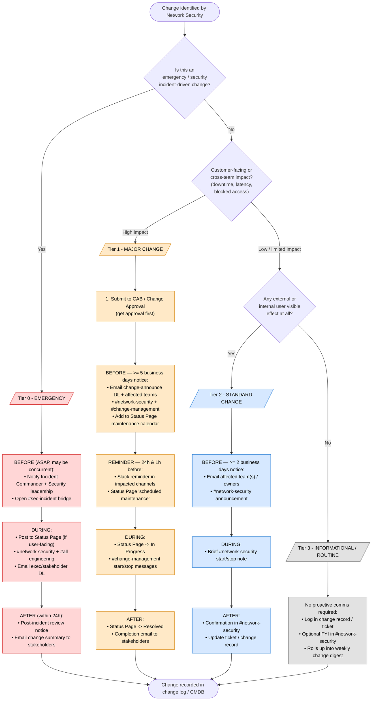

# Network Security — Change Communications Playbook

This document defines **when** and **where** the Network Security team should
send communications ("comms") for any change it makes (firewall rules, VPN,
segmentation, IDS/IPS, proxy/DNS, certificates, access policies, tooling, etc.).

> The flowchart is the source of truth for the decision flow. The tables below
> spell out timing, owners, and channels. Assumptions are listed at the bottom —
> edit them to match your org.

---

## 1. Decision flow — when & where to send comms

---

## 2. When to send — timing matrix

| Tier | Change type | Advance notice (BEFORE) | Reminders | During | After |
|------|-------------|-------------------------|-----------|--------|-------|
| **0 — Emergency** | Incident-driven, active threat, urgent patch | ASAP / concurrent | n/a | Real-time on bridge + Status Page | Post-incident review ≤ 24h |
| **1 — Major** | Downtime, broad/customer impact | ≥ 5 business days | 24h + 1h before | Start/stop + Status Page | Completion notice |
| **2 — Standard** | Limited/known impact, scheduled | ≥ 2 business days | Optional 1h before | Brief start/stop note | Confirmation in channel |
| **3 — Informational** | No user-visible impact, routine | None proactive | n/a | n/a | Weekly digest entry |

---

## 3. Where to send — channels & audiences

| Channel / destination | Tier 0 | Tier 1 | Tier 2 | Tier 3 |
|-----------------------|:------:|:------:|:------:|:------:|
| Security leadership / Incident Commander | ✅ | — | — | — |
| Exec & stakeholder email DL | ✅ | ✅ | — | — |
| `change-announce@` email DL | — | ✅ | — | — |
| Affected team owners (direct) | ✅ | ✅ | ✅ | — |
| Public/internal **Status Page** | ✅ (if user-facing) | ✅ | — | — |
| CAB / Change Approval Board | — | ✅ (approval) | log only | log only |
| Slack `#sec-incident` | ✅ | — | — | — |
| Slack `#network-security` | ✅ | ✅ | ✅ | optional FYI |
| Slack `#change-management` | — | ✅ | — | — |
| Slack `#all-engineering` | ✅ | — | — | — |
| Change log / CMDB / ticket | ✅ | ✅ | ✅ | ✅ |
| Weekly change digest | ✅ | ✅ | ✅ | ✅ |

---

## 4. Ownership (who sends)

| Tier | Drafts comms | Approves | Sends |
|------|--------------|----------|-------|
| 0 — Emergency | On-call Net Sec engineer | Incident Commander | IC / Comms lead |
| 1 — Major | Change owner | Net Sec manager + CAB | Change owner |
| 2 — Standard | Change owner | Net Sec lead | Change owner |
| 3 — Informational | Change owner | n/a | Automated digest |

---

## 5. Assumptions (edit to fit your org)

- Four change tiers (0–3) based on urgency × impact.
- Channels named (`#network-security`, `change-announce@`, Status Page, CAB,
  CMDB) are placeholders — swap for your real tools (Slack/Teams, ServiceNow,
  Jira, Statuspage/Atlassian, etc.).
- "Business days" notice windows are typical CAB defaults; tune to your SLAs.
- A central **change log / CMDB** entry is required for *every* tier, including
  emergencies (logged retroactively).
